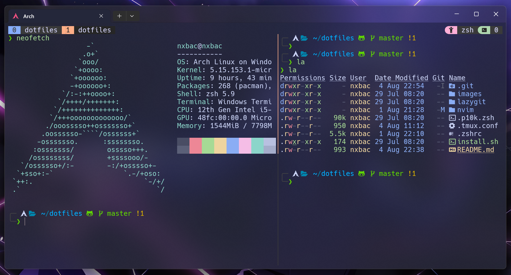
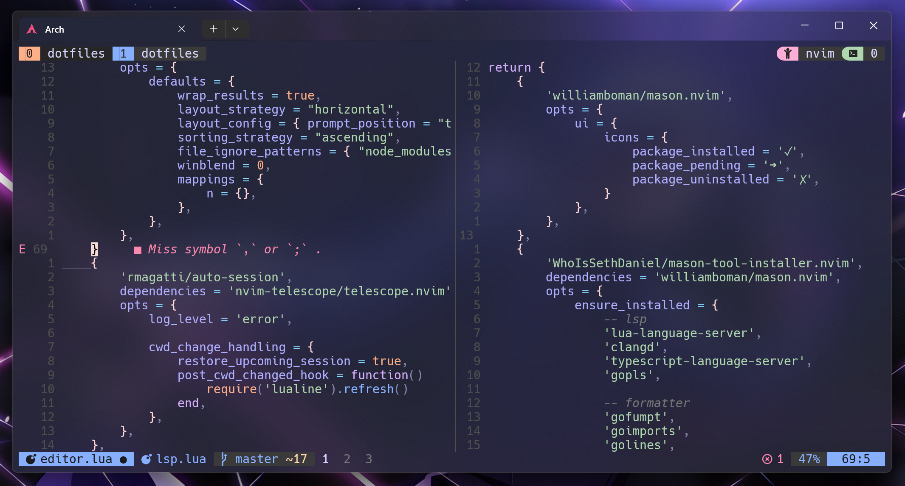

# Terminal Config (Linux)




## Requirements

- [Nerd Font (v3)](https://www.nerdfonts.com/)
- [win32yank](https://github.com/equalsraf/win32yank): the WSL2 clipboard bridge.
  Zsh, Neovim and tmux all reach it through `bin/clip`, so it is configured once.
```sh
curl -sLo /tmp/win32yank.zip https://github.com/equalsraf/win32yank/releases/latest/download/win32yank-x64.zip
unzip -p /tmp/win32yank.zip win32yank.exe | sudo tee /usr/local/bin/win32yank.exe > /dev/null
sudo chmod +x /usr/local/bin/win32yank.exe
```
> On a native X11/Wayland Linux box install `wl-clipboard` or `xclip` instead —
> `bin/clip` detects them and nothing else needs changing.

## Install

### Link configs
```sh
ln -s $PWD/.zshrc ~/.zshrc
```
```sh
ln -s $PWD/.zshenv ~/.zshenv
```
```sh
ln -s $PWD/tmux ~/.config/tmux
```
```sh
ln -s $PWD/.czrc ~/.czrc
```
```sh
ln -s $PWD/nvim ~/.config/nvim
```
```sh
mkdir -p ~/.local/bin && ln -s $PWD/bin/clip ~/.local/bin/clip
```
```sh
ln -s $PWD/lazygit ~/.config/lazygit
```
```sh
# herdr writes logs/sockets/session state into ~/.config/herdr, so symlink
# only the config file, not the whole directory.
ln -s $PWD/herdr/config.toml ~/.config/herdr/config.toml
```


### [Neovim (v0.12+)](https://neovim.io/)

Plugins are managed by the builtin `vim.pack` (requires v0.12), pinned in
`nvim/nvim-pack-lock.json`. No plugin-manager bootstrap needed.


- [lazygit](https://github.com/jesseduffield/lazygit?tab=readme-ov-file#installation)
- [ripgrep](https://github.com/BurntSushi/ripgrep?tab=readme-ov-file#installation)
- [fd](https://github.com/sharkdp/fd#installation) — Debian and Ubuntu install it as
  `fdfind`, which tools that shell out to `fd` (Telescope, for one) never find. A
  symlink fixes it for every process, where an alias would only work when typed:
```sh
ln -s "$(command -v fdfind)" ~/.local/bin/fd
```

### Zsh

No framework — `.zshrc` is plain zsh and works on both WSL and native Linux. It
feature-detects everything, so a missing tool degrades instead of erroring.

- [zsh](https://www.zsh.org/)
- [starship](https://starship.rs/guide/#step-1-install-starship) — prompt
- [zsh-autosuggestions](https://github.com/zsh-users/zsh-autosuggestions/blob/master/INSTALL.md)
- [zsh-syntax-highlighting](https://github.com/zsh-users/zsh-syntax-highlighting/blob/master/INSTALL.md)
- [zoxide](https://github.com/ajeetdsouza/zoxide#installation) — `cd` replacement

The two plugins are sourced from system paths; both the Debian
(`/usr/share/zsh-*/`) and Arch (`/usr/share/zsh/plugins/zsh-*/`) layouts are
probed, so distro packages are enough:

```sh
# Debian/Ubuntu
sudo apt install zsh-autosuggestions zsh-syntax-highlighting eza zoxide
# Arch
sudo pacman -S zsh-autosuggestions zsh-syntax-highlighting eza zoxide starship
```

**Completion** is initialised once, by `.zshrc`, after `fpath` is complete. That
needs `.zshenv` symlinked: Debian and Ubuntu run their own `compinit` from
`/etc/zsh/zshrc` before `~/.zshrc` is read, so completions added later never made
it into the dump. The dump is rebuilt at most once a day.

**Machine-local settings** go in `~/.zshrc.local` (sourced last, so it overrides)
and `~/.zshrc.local.pre` (sourced early, for PATH and `fpath` the feature detection
has to see). Neither is tracked — see `.zshrc.local.example` for which goes where.
Keeping work-only settings and installer-appended blocks there is what lets this
repo stay portable.

**Clipboard:** vi-mode `y`/`d`/`c`/`p` sync with the system clipboard through
`bin/clip`, the single entry point Neovim and tmux also use. It picks `win32yank`
on WSL, else `wl-copy` on Wayland, else `xclip`/`xsel` on X11, and `cmd | clip`
works as a standalone "copy this" command. On Arch install `wl-clipboard` or
`xclip`.

### [Tmux](https://github.com/tmux/tmux/wiki)

Config lives at `tmux/tmux.conf`, loaded from `~/.config/tmux/tmux.conf` (tmux 3.1+).
Prefix is `C-s`. Pane navigation is on `prefix + arrows`, resizing on `prefix + C-arrows`,
and vim-aware pane switching on bare `C-arrows`, which cross the Neovim/tmux boundary
transparently and work in copy-mode too. `hjkl` is deliberately left unbound in both
forms: it is a home-row run on QWERTY but four scattered keys on Colemak-DH, claiming
`C-hjkl` at the root costs `C-l` (clear-screen) in the shell, and `prefix + l` is worth
more as tmux's own `last-window`.

Plugins are managed by [TPM](https://github.com/tmux-plugins/tpm) and used **only** for
session persistence — the status bar and vim-tmux-navigator integration are hand-rolled in
the config, so tmux is fully usable before plugins are installed.

```sh
git clone https://github.com/tmux-plugins/tpm ~/.config/tmux/plugins/tpm
```
Then start tmux and press `prefix + I` to install
[tmux-resurrect](https://github.com/tmux-plugins/tmux-resurrect) and
[tmux-continuum](https://github.com/tmux-plugins/tmux-continuum).

- Sessions auto-save every 15 minutes, scrollback included, and are restored
  automatically when the server starts; save manually with `prefix + S`, restore with
  `prefix + C-r`.
- Sessions are auto-named after the current directory, but only when tmux named them
  itself — `tmux new -s <name>` keeps the name you gave it. New windows and splits name
  the *window*, not the session.
- Resurrect's save key is moved off its `prefix + C-s` default, which would otherwise
  collide with `send-prefix` (the prefix is itself `C-s`).
- `prefix + Space` opens the session picker; `prefix + w` shows the same tree with
  windows expanded.
- `prefix + r` reloads the config.

> `~/.config/tmux` is a symlink into this repo, so the live tmux config follows whichever
> branch is checked out — same as `~/.config/nvim`.

### Terminal

- [eza](https://github.com/eza-community/eza/blob/main/INSTALL.md)

### [Commitizen](https://github.com/commitizen/cz-cli)
```shell
npm install commitizen -g
npm install -g cz-conventional-changelog
```
